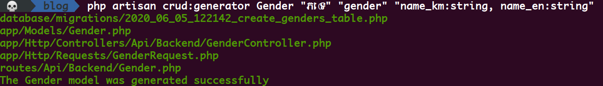

# Laravel CRUD Generator
The basic laravel crud generator.

## Installation
```
composer require laramab/crudgenerator
```

Add crud generator service provider

```
Laramab\Crudgenerator\CrudGeneratorServiceProvider::class,
```

Published configuration

````php
php artisan vendor:publish --provider="Laramab\Crudgenerator\CrudGeneratorServiceProvider"
````
it will generate ```crud-generator.php``` configuration file which is allow you can custom your own route, model, migration and controller directory

```php
<?php

return [
    /*
    |--------------------------------------------------------------------------
    | Model directory
    |--------------------------------------------------------------------------
    |
    | This value is the name of your application. This value is used when the
    | framework needs to place the application's name in a notification or
    | any other location as required by the application or its packages.
    |
    */
    'path_model' => 'app/Models',
    /*
    |--------------------------------------------------------------------------
    | Controller directory
    |--------------------------------------------------------------------------
    |
    | This value is the name of your application. This value is used when the
    | framework needs to place the application's name in a notification or
    | any other location as required by the application or its packages.
    |
    */
    'path_controller' => 'app/Http/Controllers/Frontend',
    /*
    |--------------------------------------------------------------------------
    | Route directory
    |--------------------------------------------------------------------------
    |
    | This value is the name of your application. This value is used when the
    | framework needs to place the application's name in a notification or
    | any other location as required by the application or its packages.
    |
    */
    'path_route' => 'routes/Backend',
    /*
    |--------------------------------------------------------------------------
    | Request directory
    |--------------------------------------------------------------------------
    |
    | This value is the name of your application. This value is used when the
    | framework needs to place the application's name in a notification or
    | any other location as required by the application or its packages.
    |
    */
    'path_request' => 'app/Http/Requests',
];
```

## Usage

```php
php artisan crud:generator Post "title:string, body:text, is_active:boolean, published_at:dateTime"
```


